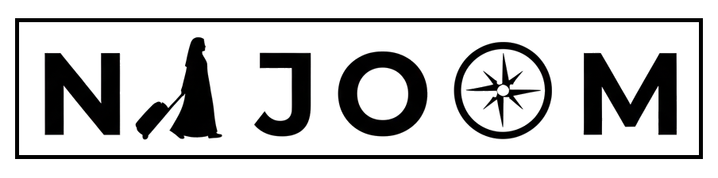

  

    

      
    

    

        
Travel abayas • Coming soon

      
Refined essentials for graceful travel and effortless everyday elegance.

      
We’re preparing a beautifully curated collection of travel abayas designed to make travel easier while feeling polished, comfortable, and timeless.

      
Stay tuned — our new collection is almost here.

    

  

